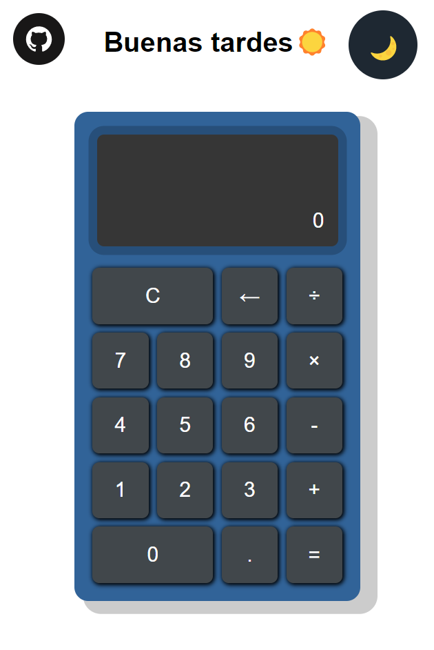

# Calculadora con HTML CSS y Javascript

Hola, bienvenidos a mi primer proyecto de calculadora, pueden ver mi proyecto siguiendo el enlace que les dejare abajo.

El proyecto esta subido a un hosting gratuito el cual es _Firebase_.

➡️➡️ [Enlace al proyecto](https://calculadora-6e078.firebaseapp.com/)

### Anexo del proyecto:

---

Cualquier sugerencia, duda o pregunta no duden en contactarme mediante mis redes sociales.🤓

- [Facebook](https://www.facebook.com/luisadrian.nunezjara)
- [Twitter](https://twitter.com/LuisAdrianNuez?t=LGtN8Y_iq9YpiaTIVvOgBQ&s=09)
- [Instagram](https://instagram.com/luizackjs?igshid=ZDdkNTZiNTM=)
